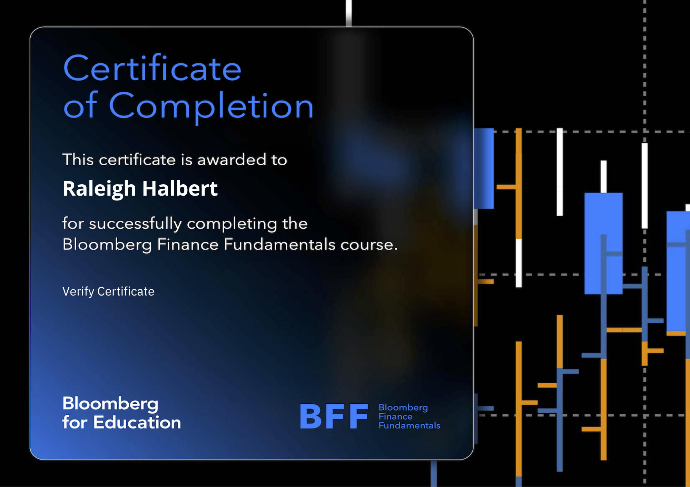
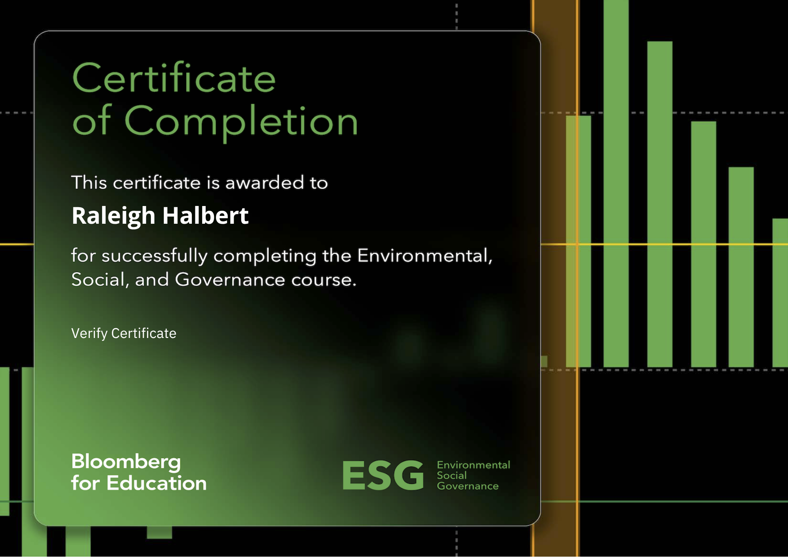
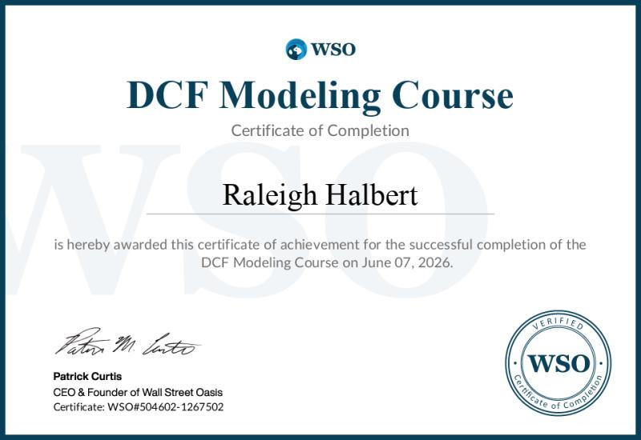

**These certifications have strengthened my technical foundation in finance and data analysis. EDIT THIS LATERRRRRRRRR TO BE BETTTTTTTERRRRRR**

::::: cert-grid
::: cert-card
```{=html}
<a href="https://portal.bloombergforeducation.com/certificates/QchtKQBuPwnj7ywrvb4FeD1c"
   target="_blank"
   rel="noopener noreferrer">
```

<h3>Bloomberg Market Concepts</h3>

```{=html}

```

</a>
:::

::: cert-card
```{=html}
<a href="https://portal.bloombergforeducation.com/certificates/QchtKQBuPwnj7ywrvb4FeD1c"
   target="_blank"
   rel="noopener noreferrer">
```

<h3>Bloomberg Finance Fundamentals</h3>

```{=html}

```

</a>
:::
:::::

::::: cert-grid
::: cert-card
```{=html}
<a href="https://portal.bloombergforeducation.com/certificates/fgWaj4q6joR1sehkXJEMqtWv"
   target="_blank"
   rel="noopener noreferrer">
```

<h3>Bloomberg Environmental Social Governance</h3>

```{=html}

```

</a>
:::

::: cert-card
```{=html}
<a href="https://www.certiport.com/portal/pages/credentialverification.aspx"
   target="_blank"
   rel="noopener noreferrer">
```

<h3>Microsoft Excel Basic</h3>

```{=html}

```

</a>
:::
:::::


::::: cert-grid
::: cert-card
```{=html}
<a href="https://www.wallstreetoasis.com/files/certificates/504602/1267502/504602-1267502.png"
   target="_blank"
   rel="noopener noreferrer">
```

<h3>Discounted Cash Flows Model</h3>

```{=html}

```

</a>
:::
:::::
